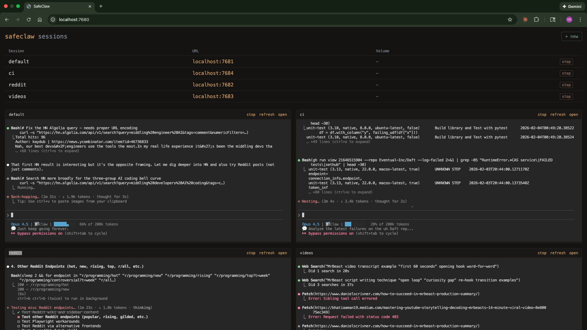

# SafeClaw

The easiest way to run multiple Claude Code sessions, each in its own container, with a dashboard to manage them all. Quick setup with battle-tested [sensible defaults](#sensible-defaults).

https://github.com/user-attachments/assets/e282ed8f-3ec9-4a9e-aa9e-4bc84f9281e9

See [architecture.md](architecture.md) for design details.

## Why a container?

- **Isolated** - Claude Code runs with bypass permissions, but can't touch your host machine.
- **Lightweight** - Spin up, stop, or delete sessions in seconds. Much faster than a full VM.
- **Portable** - Works on any machine with Docker. Same environment everywhere.

This lets you run Claude Code with `--dangerously-skip-permissions` safely and fast.

## One session per container

Each Claude Code session runs in its own container. Spin up as many as you need - they're isolated from each other and start in seconds. Run different research tasks, projects, or experiments in parallel without interference. Conversation history is automatically stored on your host machine via a volume mount.

## Quickstart

```bash
# Build image (once, or after changes)
./scripts/build.sh

# Start container and web terminal
./scripts/run.sh

# To mount a local project (host_path:container_path)
./scripts/run.sh -v ~/myproject:/home/sclaw/myproject

# Run multiple sessions with -s
./scripts/run.sh -s work        # safeclaw-work on next available port
./scripts/run.sh -s research    # safeclaw-research on next available port
```

On first run, `run.sh` will prompt you to set up authentication tokens. It then starts a web terminal at http://localhost:7681 and opens it in your browser.

## Dashboard



Manage all sessions from a web dashboard:

```bash
node dashboard/server.js
```

Opens at http://localhost:7680 with:
- Create new sessions with volume mounts and initial queries
- All sessions listed with start/stop/delete controls
- Live iframe views of active sessions

## Optional integrations

- `./scripts/setup-gemini.sh` - Add Gemini CLI access
- `./scripts/setup-slack.sh` - Add Slack read access

## What's included

- Ubuntu 24.04
- Node.js 24 (LTS)
- Claude Code 2.1.30 (with [optimized system prompt](https://github.com/ykdojo/claude-code-tips#tip-15-slim-down-the-system-prompt) - starts at ~5% context instead of ~9%)
- GitHub CLI with auto-configured git user
- Playwright MCP with Chromium
- Gemini CLI 0.26.0 (optional - requires API key)
- Slack read-only skill and tool (optional - requires token)
- [DX plugin](https://github.com/ykdojo/claude-code-tips#tip-44-install-the-dx-plugin), [custom status line](https://github.com/ykdojo/claude-code-tips#tip-0-customize-your-status-line), [shell aliases](#aliases)
- ttyd web terminal + tmux

## Sensible defaults

- Claude Code version pinned (currently 2.1.30)
- `autoCompactEnabled: false` - prevents automatic context compaction
- `promptSuggestionEnabled: false` - disables prompt suggestions
- Auto [half-clone](https://github.com/ykdojo/claude-code-tips#half-clone-to-reduce-context) hook at 85% context usage
- `--dangerously-skip-permissions` enabled (because it's containerized)

## Conversation history

Each session's conversation history persists locally at:

```
~/.config/safeclaw/sessions/<session-name>/
```

This maps to `/home/sclaw/.claude/projects/` inside the container. Conversations are stored as JSONL files. Rebuilding containers or restarting sessions won't affect your history.

## Authentication

Tokens are stored in `~/.config/safeclaw/.secrets/` and injected as env vars on each run. The filename becomes the env var name.

| File | How to generate |
|------|-----------------|
| `CLAUDE_CODE_OAUTH_TOKEN` | `claude setup-token` (valid 1 year) |
| `GH_TOKEN` | `gh auth token` or create a PAT at github.com/settings/tokens |
| `GEMINI_API_KEY` | Optional - get from aistudio.google.com |
| `SLACK_TOKEN` | Optional - `./scripts/setup-slack.sh` |

You can add any additional secrets by creating files in the `.secrets/` directory.

## Scripts

| Script | Description |
|--------|-------------|
| `scripts/build.sh` | Build the Docker image and remove old container |
| `scripts/run.sh` | Start/reuse container, inject auth, start ttyd. Use `-s name` for named sessions, `-v` for volumes, `-n` to skip opening browser, `-q "question"` to start with a query. |
| `scripts/restart.sh` | Kill and restart the web terminal (ttyd + tmux). Use `-s name` for named sessions. |
| `scripts/setup-gemini.sh` | Set up Gemini CLI (optional) |
| `scripts/setup-slack.sh` | Set up Slack integration (optional) |
| `scripts/manage-env.js` | Manage environment variables (list, add, delete) |
| `dashboard/server.js` | Web dashboard for managing multiple sessions |

## Aliases

Inside each container, these aliases are available:

| Alias | Command |
|-------|---------|
| `c` | `claude` |
| `cs` | `claude --dangerously-skip-permissions` |
